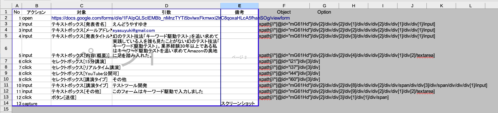

幻のテスト技法「キーワード駆動テスト」を追い求めて
====

2022-12-03 [@eyasuyuki](https://twitter.com/eyasuyuki)

<!-- paginate: true -->

---

# 結論

- キーワード駆動テストは、


---

# 結論

- キーワード駆動テストは、意外に簡単だった

---

# そもそもキーワード駆動テストとは


- 操作を表すアクションキーワードと、その対象となるデータで構成された表を使って行うテスト
- 人間可読のキーワード表と実際の画面を結びつける**ドライバーを書けば**自動化できる

---

# キーワード駆動テストが登場する本その1

- システムテスト自動化標準ガイド (Mark Fewster, Dorothy Graham 1999)
    - ISBN978-4-7981-3921-0


- 概念的なエピソードは書かれているが、具体的な実装については書かれていない

---

# キーワード駆動テストが登場する本その2

- ソフトウエア品質を高める開発者テスト改訂版 (高橋寿一 2022)
    - ISBN978-4-7981-7639-0


- この本でキーワード駆動テストを知った。ただし概要だけしか書かれていない

---

# キーワード駆動テストを知った頃のツイート


[https://twitter.com/eyasuyuki/status/1562708740243337216](https://twitter.com/eyasuyuki/status/1562708740243337216)

---

# 幻のテスト技法?

- 業界経験30年以上になるが、キーワード駆動テストをやっている人を一度も見たことがない

---

# 既存のキーワード駆動テストツールその1

## Open2Test

[https://github.com/open2test/Open2Test_Selenium](https://github.com/open2test/Open2Test_Selenium)

### 目的に合わなかった理由

- キーワード表の形式が気に入らない(納品物にならない)
- ソースコードがないので自由に改造できない
- 余計な機能がある(データの読み込みなど)

---

# 既存のキーワード駆動テストツールその2

## Robot framework

[https://robotframework.org](https://robotframework.org)

### 目的に合わなかった理由

- キーワード表の形式が気に入らない(納品物にならない)

---

# ふとひらめいたアイデア💡


[https://twitter.com/eyasuyuki/status/1562710231851073538](https://twitter.com/eyasuyuki/status/1562710231851073538)

---

# 拡張されたキーワード表



- 印刷範囲外の列に画面依存の情報を書いている

---

# 動作概念図

<div class="mermaid" style="font-size: 50%; text-align: center;">
sequenceDiagram
    Keydriver ->> POI: Excelファイル読み込み
    POI ->> Excel: 読み込み
    Excel ->> POI: ワークシート
    POI ->> Keydriver: ワークシート
    Keydriver ->> WebDriver: ブラウザ操作
    WebDriver ->> ブラウザ: ブラウザ操作
    ブラウザ ->> WebDriver: ブラウズ結果
    WebDriver ->> Keydriver: ブラウズ結果
    Keydriver ->> Keydriver: 結果検証
</div>
<script src="https://unpkg.com/mermaid@8.14.0/dist/mermaid.min.js"></script>
<script>mermaid.initialize({startOnLoad:true});</script>

---

# 今回開発したツール

## Keydriver
[https://github.com/eyasuyuki/keydriver](https://github.com/eyasuyuki/keydriver)

- ノーコードでe2eテストができる
- オープンソース
- 商用利用可(MITライセンス)
- 気に入ったら☆(Star)ください🙇

---

# デモ

---

# 利用可能なキーワード

| キーワード | 説明 |
------------|-------
| open | URLを開く |
| click | 要素をクリックする |
| select | select要素を選択する |
| input | input要素に入力する |
| clear | input要素をクリアする |
| accept | ダイアログでOKする |
| dismiss | ダイアログをキャンセルする |
| capture | スクリーンショットを撮る |
| upload | file要素にファイル名を入力する |
| assert | 値を検査する |
| execute | SQLを実行する |

---

# 要素のセレクタの表記法

```
tag[value#attribute]
```

例
```
id[save_button]
id[save_button#enabled]
name[name_input#displayed]
xpath[/html/head/title]
```

---


