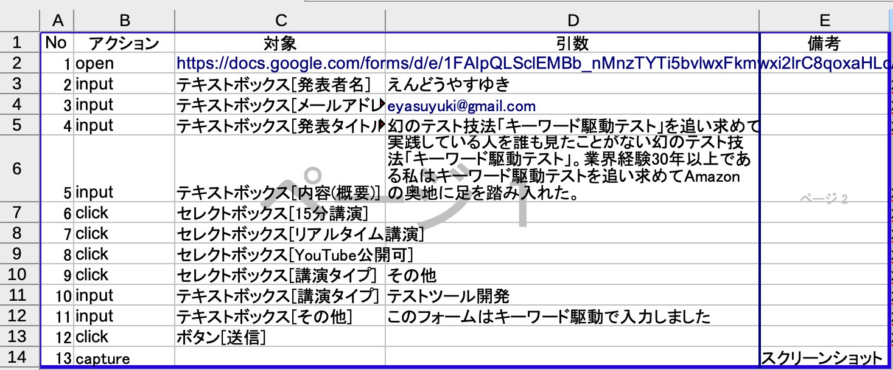

幻のテスト技法「キーワード駆動テスト」を追い求めて
====

2022-12-03 [@eyasuyuki](https://twitter.com/eyasuyuki)

<!-- paginate: true -->

---

# 結論

- キーワード駆動テストは、


---

# 結論

- キーワード駆動テストは、意外に簡単だった

---

# そもそもキーワード駆動テストとは




- 操作を表すアクションキーワードと、その対象となるデータで構成された表を使って行うテスト
- 人間可読のキー         ワード表と実際の画面を結びつける**ドライバーを書けば**自動化できる

---

# キーワード駆動テストの位置付け


ソフトウエア品質を高める開発者テスト改訂版 (高橋寿一 2022) p.138 より

---

# キーワード駆動テストが登場する本その1

- システムテスト自動化標準ガイド (Mark Fewster, Dorothy Graham 1999)
    - ISBN978-4-7981-3921-0


- 概念的なエピソードは書かれているが、具体的な実装については書かれていない

---

# キーワード駆動テストが登場する本その2

- ソフトウエア品質を高める開発者テスト改訂版 (高橋寿一 2022)
    - ISBN978-4-7981-7639-0


- この本でキーワード駆動テストを知った。ただし概要だけしか書かれていない

---

# キーワード駆動テストを知った頃のツイート


[https://twitter.com/eyasuyuki/status/1562708740243337216](https://twitter.com/eyasuyuki/status/1562708740243337216)

---

# 幻のテスト技法?

- 業界経験30年以上になるが、キーワード駆動テストをやっている人を一度も見たことがない

---

# 既存のキーワード駆動テストツールその1

## Open2Test

[https://github.com/open2test/Open2Test_Selenium](https://github.com/open2test/Open2Test_Selenium)

### 目的に合わなかった理由

- キーワード表の形式が気に入らない(納品物にならない)
- ソースコードがないので自由に改造できない
- 余計な機能がある(データの読み込みなど)

---

# Open2Testのテストケース


---

# 既存のキーワード駆動テストツールその2

## Robot framework

[https://robotframework.org](https://robotframework.org)

### 目的に合わなかった理由

- キーワード表の形式が気に入らない(納品物にならない)

---

# Robot frameworkのテストケース(1/2)


---

# Robot frameworkのテストケース(2/2)


---

# ふとひらめいたアイデア💡


[https://twitter.com/eyasuyuki/status/1562710231851073538](https://twitter.com/eyasuyuki/status/1562710231851073538)

---

# 拡張されたキーワード表


- 印刷範囲外の列に画面依存の情報を書いている

---

# 今回開発したツール

## Keydriver
[https://github.com/eyasuyuki/keydriver](https://github.com/eyasuyuki/keydriver)

- ノーコードでe2eテストができる
- オープンソース
- 商用利用可(MITライセンス)
- 気に入ったら☆(Star)ください🙇

### Zennの記事

[https://zenn.dev/eyasuyuki/articles/a20301d34adce0](https://zenn.dev/eyasuyuki/articles/a20301d34adce0)

---

# 動作概念図

@startuml
    Keydriver ->> POI: Excelファイル読み込み
    POI ->> Excel: 読み込み
    Excel ->> POI: ワークシート
    POI ->> Keydriver: ワークシート
    Keydriver ->> WebDriver: ブラウザ操作
    WebDriver ->> ブラウザ: ブラウザ操作
    ブラウザ ->> WebDriver: ブラウズ結果
    WebDriver ->> Keydriver: ブラウズ結果
    Keydriver ->> Keydriver: 結果検証
    Keydriver ->> POI: テスト結果出力
    POI ->> Excel: テスト結果出力
@enduml

---

# デモ

[https://youtu.be/Klqx18-cBgw](https://youtu.be/Klqx18-cBgw)


---

# 利用可能なキーワード

| No  | キーワード             | 説明 |
-----|-------------------|-------
| 1   | open | URLを開く            |
| 2   | click      | 要素をクリックする         |
| 3   | select     | select要素を選択する     |
| 4   | input      | input要素に入力する      |
| 5   | clear      | input要素をクリアする     |
| 6   | accept     | ダイアログでOKする        |
| 7   | dismiss    | ダイアログをキャンセルする     |
| 8   | capture    | スクリーンショットを撮る      |
| 9   | upload     | file要素にファイル名を入力する |
| 10  | assert     | 値を検査する            |
| 11  | execute    | SQLを実行する          |
| 12  | _DIRECTIVE | デフォルトキーワード        |


※ 1〜11のどれにも一致しないキーワードが使われた場合、デフォルトキーワードとして解釈される

※※ デフォルトキーワードは```sheet[ワークシート名]```で指定したワークシートをサブルーチンのように実行することができる。

---

# 要素セレクタの表記法

```
tag[value#attribute]
```

| タグ | 説明 |
-------|-------
| id | id要素 |
| name | name要素 |
| xpath | xpath |

例
```
id[save_button]
id[save_button#enabled]
name[name_input#displayed]
xpath[/html/head/title]
```

※ デフォルトの```attribute```は```innerText```

---

# データ型

```
tag[value]
```

上記の形式で下記のデータを表現できる。

| タグ | 値 | 説明                                                                 |
-------|----|--------------------------------------------------------------------
| text  | 文字列 | デフォルトのデータ型である                                                      |
| url   | URL         | HTTP-URLやJDBC接続URLを表現する                                            |
| sql | SQL文        |                                                                    |
| sheet | ワークシート名     | デフォルトキーワード```_DIRECTIVE```とともに使用する。指定したワークシートをサブルーチンのように実行することができる |

----

# 述語

```
tag[value]
```

述語はキーワード```assert```とともに使用する。タグに下記を使うことでそれぞれの述語を表現できる。

| タグ | 説明    |
-------|-------
| is | 等価    |
| isNot | 非等価   |
| isNull | null  |
| isNotNull | 非null |
| greaterThan | より大きい |
| greaterThanEqual | 以上    |
| lessThan | より小さい |
| lessThanEqual | 以下    |
| fail | 失敗    |

----

# Keydriverのメリット(1/4)

- ノーコードで自動テストが行えるので、**ビジネスゴールが達成されるかどうかのテストに注力できる**


Copyright (c) Vector4Stock - Freepik.com


----

# Keydriverのメリット(2/4)

- ドメインエキスパートがキーワード表を作成し、テストエンジニアが実際の画面要素のセレクタを記述するといった**分業が可能になる**


Copyright (c) Studiogstock - Freepik.com

----

# Keydriverのメリット(3/4)


- 画面が変更されても**ドライバーをメンテナンスする必要はなく**、キーワード表をメンテナンスすれば済む

@startuml
file キーワード表 as k1
frame 他のキーワード駆動ツール {
component Driver as d1
component Reader as r1
}
r1 -down-> d1
actor ドメインエキスパート as e1
actor テストエンジニア as t1
node ブラウザ as b1
e1 -up->> k1: 作成
t1 -up->> d1: メンテナンス
r1 -le->> k1: 読み込み
d1 -ri->> b1: 操作
@enduml

@startuml
file キーワード表 as k1
frame Keydriver {
component Driver as d1
component Reader as r1
}
r1 -down-> d1
actor ドメインエキスパート as e1
actor テストエンジニア as t1
node ブラウザ as b1
e1 -up->> k1: 作成
t1 -up->> k1: メンテナンス
r1 -le->> k1: 読み込み
d1 -ri->> b1: 操作
@enduml


----

# Keydriverのメリット(4/4)


- 他のワークシートをサブルーチンのように実行できるため、**キーワードの階層化が可能**になる


---

# Keydriverをぜひ試してみてください!

[https://github.com/eyasuyuki/keydriver](https://github.com/eyasuyuki/keydriver)


---

# ソフトウェアテストアドベントカレンダー2022 12/3

[https://qiita.com/advent-calendar/2022/softwaretesting](https://qiita.com/advent-calendar/2022/softwaretesting)

こちらで取り上げていただきました。


